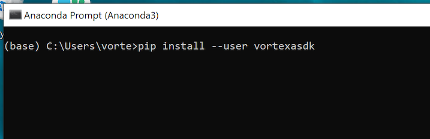
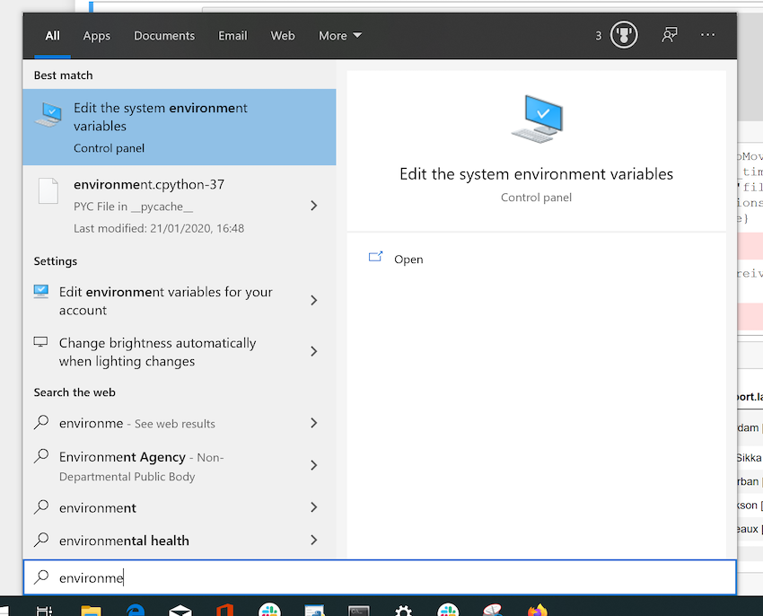
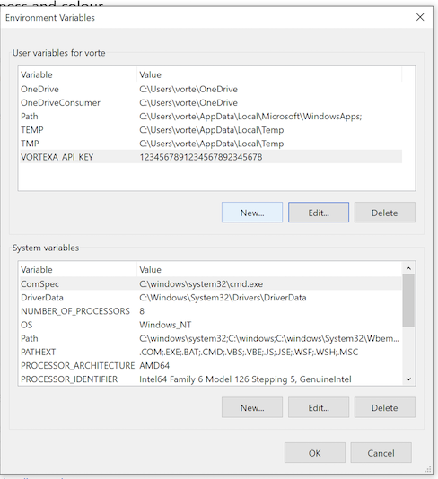
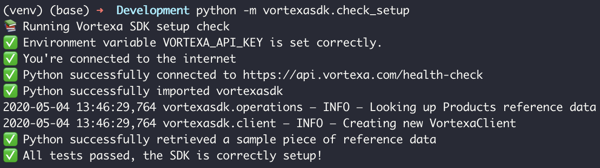
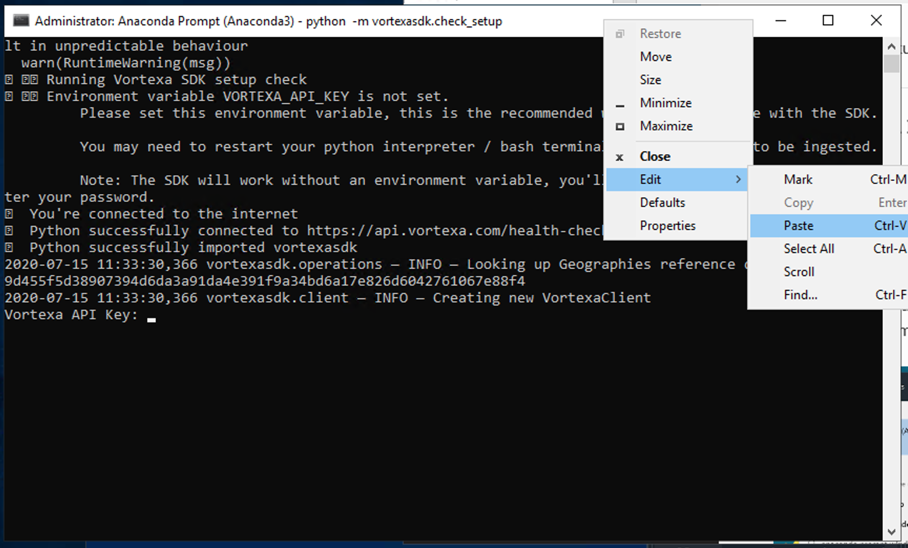

#### How to install Python on Windows using Anaconda
- Download the Python3.7 Graphical installer from the [anaconda website](https://www.anaconda.com/distribution/)
- Follow the conda installation instructions


#### How do I install the SDK on Windows?
- First, open up an Anaconda Prompt. Hit the start button and type anaconda prompt.


- Use pip to install the sdk

Run `pip install --user vortexasdk` in the anaconda command prompt



You're done! The VortexaSDK has now been installed.


#### How do I install the SDK on Mac / Linux?
Type the following into a bash terminal
```bash
$ pip install vortexasdk
```


#### How do I add an environment variable on Windows?
- Hit the windows key, then type "environment" to open up a control panel settings page titled "Edit the system environment variables"



-  In the System Properties window, click on the Advanced tab, then click the Environment Variables button near the bottom of that tab.
- Add a new user variable




#### Where is my API Key?
Refer to [Vortexa API Authentication](https://docs.vortexa.com/reference/intro-authentication)
 for details, including instructions on where to find your API key.

#### How do I request an API Key?
You can [request a demo here](https://www.vortexa.com/request-demo-sdk).

More details are given in [docs.vortexa.com](https://docs.vortexa.com/reference/intro-authentication).

Alternatively, please get in touch at [www.vortexa.com](https://www.vortexa.com/).


#### How can I check the SDK is setup correctly?

Run the following in a bash console on Mac/Linux, or command prompt on Windows:

```bash
$ python -m vortexasdk.check_setup
```

A successful setup looks like this:




On Windows, you'll need to paste the API key by right clicking the console menu, like so:


Hitting Ctrl+V won't paste the API key, this is due to a [known python windows bug](https://bugs.python.org/issue37426)

